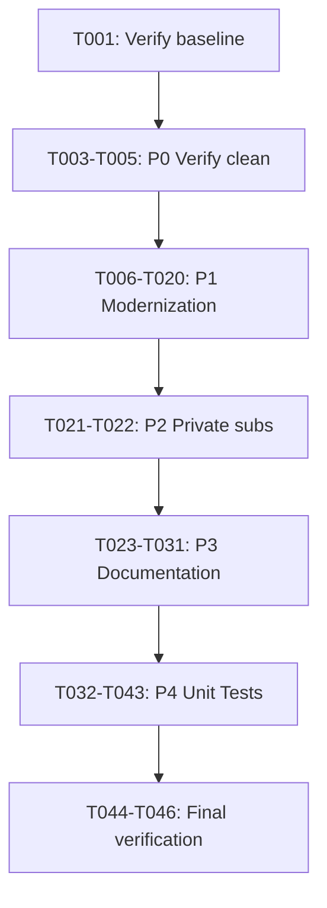

# Tasks: Modernize RBLLookup.pm

**Input**: Design documents from `/specs/005-modernize-rbllookup/`
**Prerequisites**: plan.md (required), spec.md (required for user stories)

**Tests**: Tests are requested per User Story 4 (P4) in the specification.

**Organization**: Tasks are grouped by user story to enable independent implementation and testing of each story.

## Format: `[ID] [P?] [Story] Description`

- **[P]**: Can run in parallel (different files, no dependencies)
- **[Story]**: Which user story this task belongs to (e.g., US0, US1, US2, US3, US4)
- Include exact file paths in descriptions

## Phase 1: Setup

**Purpose**: Verify prerequisites and establish baseline

- [X] T001 Verify module compiles before changes: `perl -cw -Ilib lib/ConfigServer/RBLLookup.pm`
- [X] T002 Create backup reference of current module behavior for SC-009 comparison (document sample inputs/outputs)

---

## Phase 2: User Story 0 - Remove Legacy Comment Clutter (Priority: P0)

*Cross-ref: plan.md "Phase 1: P0 - Verify No Legacy Comment Clutter"*

**Goal**: Verify no legacy comment clutter exists (already clean per spec analysis)

**Independent Test**: Grep for `# start`, `# end`, `###...###` patterns between subroutines

- [X] T003 [US0] Verify no `# start`/`# end` comment markers exist in lib/ConfigServer/RBLLookup.pm
- [X] T004 [US0] Verify no `###...###` dividers between subroutines in lib/ConfigServer/RBLLookup.pm
- [X] T005 [US0] Verify module still compiles: `perl -cw -Ilib lib/ConfigServer/RBLLookup.pm`

**Checkpoint**: P0 complete - module is confirmed clean of legacy comments

---

## Phase 3: User Story 1 - Code Modernization (Priority: P1) 🎯 MVP

*Cross-ref: plan.md "Phase 2: P1 - Code Modernization"*

**Goal**: Remove package-level config loading, disable imports, remove Exporter machinery, use fully qualified names

**Independent Test**: `perl -cw -Ilib lib/ConfigServer/RBLLookup.pm` passes and no package-level `loadconfig()` exists

### Implementation for User Story 1

- [X] T006 [US1] Remove `use Fcntl qw(:DEFAULT :flock);` entirely from lib/ConfigServer/RBLLookup.pm (unused)
- [X] T007 [US1] Change `use IPC::Open3;` to `use IPC::Open3 ();` in lib/ConfigServer/RBLLookup.pm
- [X] T008 [US1] Change `use Net::IP;` to `use Net::IP ();` in lib/ConfigServer/RBLLookup.pm
- [X] T009 [US1] Change `use ConfigServer::CheckIP qw(checkip);` to `use ConfigServer::CheckIP ();` in lib/ConfigServer/RBLLookup.pm
- [X] T010 [US1] Remove `use Exporter qw(import);` from lib/ConfigServer/RBLLookup.pm
- [X] T011 [US1] Remove `our @ISA = qw(Exporter);` from lib/ConfigServer/RBLLookup.pm
- [X] T012 [US1] Remove `our @EXPORT_OK = qw(rbllookup);` from lib/ConfigServer/RBLLookup.pm
- [X] T013 [US1] Remove package-level `my $config = ConfigServer::Config->loadconfig();` from lib/ConfigServer/RBLLookup.pm
- [X] T014 [US1] Remove package-level `my %config = $config->config();` from lib/ConfigServer/RBLLookup.pm
- [X] T015 [US1] Replace `checkip(\$ip)` with `ConfigServer::CheckIP::checkip(\$ip)` in rbllookup()
- [X] T016 [US1] Replace first `open3(...)` call with `IPC::Open3::open3(...)` in rbllookup() (A record lookup)
- [X] T017 [US1] Replace second `open3(...)` call with `IPC::Open3::open3(...)` in rbllookup() (TXT record lookup)
- [X] T018 [US1] Replace first `$config{HOST}` with `ConfigServer::Config->get_config('HOST')` in rbllookup()
- [X] T019 [US1] Replace second `$config{HOST}` with `ConfigServer::Config->get_config('HOST')` in rbllookup()
- [X] T020 [US1] Verify module compiles: `perl -cw -Ilib lib/ConfigServer/RBLLookup.pm`

**Checkpoint**: P1 complete - module follows modern Perl standards, no package-level side effects

---

## Phase 4: User Story 2 - Make Internal Subroutines Private (Priority: P2)

*Cross-ref: plan.md "Phase 3: P2 - Make Internal Subroutines Private"*

**Goal**: Mark internal helper functions as private with underscore prefix

**Independent Test**: Verify no internal helpers exist (only `rbllookup` which is public)

- [X] T021 [US2] Verify `rbllookup()` remains public (no underscore prefix) in lib/ConfigServer/RBLLookup.pm
- [X] T022 [US2] Confirm no internal helper functions exist that need renaming (module has only 1 function)

**Checkpoint**: P2 complete - no changes needed (module already has clean API)

---

## Phase 5: User Story 3 - Add POD Documentation (Priority: P3)

*Cross-ref: plan.md "Phase 4: P3 - Add POD Documentation"*

**Goal**: Add comprehensive POD documentation for the module and public function

**Independent Test**: `podchecker lib/ConfigServer/RBLLookup.pm` reports no errors; `perldoc` shows documentation

### Implementation for User Story 3

- [X] T023 [US3] Add POD NAME section after copyright header (line 19) in lib/ConfigServer/RBLLookup.pm
- [X] T024 [US3] Add POD SYNOPSIS section with usage example in lib/ConfigServer/RBLLookup.pm
- [X] T025 [US3] Add POD DESCRIPTION section explaining RBL lookups in lib/ConfigServer/RBLLookup.pm
- [X] T026 [US3] Add POD documentation for `rbllookup()` function (parameters, return values) in lib/ConfigServer/RBLLookup.pm
- [X] T027 [US3] Add POD SEE ALSO section referencing ConfigServer::RBLCheck, ConfigServer::CheckIP in lib/ConfigServer/RBLLookup.pm
- [X] T028 [US3] Add POD LICENSE section in lib/ConfigServer/RBLLookup.pm
- [X] T029 [US3] Add `=cut` to close POD block before `package` statement in lib/ConfigServer/RBLLookup.pm
- [X] T030 [US3] Validate POD: `podchecker lib/ConfigServer/RBLLookup.pm`
- [X] T031 [US3] Verify documentation renders: `perldoc lib/ConfigServer/RBLLookup.pm`

**Checkpoint**: P3 complete - module has proper POD documentation

---

## Phase 6: User Story 4 - Add Unit Test Coverage (Priority: P4)

*Cross-ref: plan.md "Phase 5: P4 - Add Unit Test Coverage"*

**Goal**: Create comprehensive unit tests with mocked external dependencies

**Independent Test**: `PERL5LIB='' prove -wlvm t/ConfigServer-RBLLookup.t` passes

### Implementation for User Story 4

- [X] T032 [US4] Create test file t/ConfigServer-RBLLookup.t with standard header (shebang, cPstrict, Test2::V0)
- [X] T033 [US4] Add MockConfig import and set HOST config value in t/ConfigServer-RBLLookup.t
- [X] T034 [US4] Add test: module loads without package-level side effects in t/ConfigServer-RBLLookup.t
- [X] T035 [US4] Add test: invalid IP returns empty strings without DNS query in t/ConfigServer-RBLLookup.t
- [X] T036 [US4] Add test: valid IPv4 address triggers correct reversed lookup format in t/ConfigServer-RBLLookup.t
- [X] T037 [US4] Add test: valid IPv6 address triggers correct reversed lookup format in t/ConfigServer-RBLLookup.t
- [X] T038 [US4] Add test: RBL hit returns IP and TXT record (mocked open3) in t/ConfigServer-RBLLookup.t
- [X] T039 [US4] Add test: RBL not listed returns empty strings (mocked open3) in t/ConfigServer-RBLLookup.t
- [X] T040 [US4] Add test: timeout scenario returns "timeout" (mocked alarm/die) in t/ConfigServer-RBLLookup.t
- [X] T041 [US4] Add done_testing() at end of t/ConfigServer-RBLLookup.t
- [X] T042 [US4] Verify test file compiles: `perl -cw -Ilib t/ConfigServer-RBLLookup.t`
- [X] T043 [US4] Run tests: `PERL5LIB='' prove -wlvm t/ConfigServer-RBLLookup.t`

**Checkpoint**: P4 complete - module has comprehensive unit test coverage

---

## Phase 7: Polish & Final Verification

**Purpose**: Final validation and regression testing

- [X] T044 Run full test suite for regressions: `make test`
- [X] T045 Verify all success criteria from spec.md are met
- [X] T046 Update VERSION if needed (currently 1.01) in lib/ConfigServer/RBLLookup.pm

---

## Dependencies

## Parallel Execution Opportunities

Within each phase, tasks marked with [P] can be executed in parallel:

- **Phase 3 (P1)**: T006, T007, T008, T009 can run in parallel (all import changes)
- **Phase 3 (P1)**: T010, T011, T012 can run in parallel (all Exporter removal)
- **Phase 5 (P3)**: T023, T024, T025, T026, T027, T028 can run in parallel (all POD additions)
- **Phase 6 (P4)**: T034, T035, T036, T037, T038, T039, T040 can run in parallel (independent test cases)

## Summary

| Phase | User Story | Task Count | Status |
|-------|------------|------------|--------|
| 1 | Setup | 2 | Not Started |
| 2 | US0 - Legacy Comments | 3 | Not Started |
| 3 | US1 - Code Modernization (MVP) | 15 | Not Started |
| 4 | US2 - Private Subroutines | 2 | Not Started |
| 5 | US3 - POD Documentation | 9 | Not Started |
| 6 | US4 - Unit Tests | 12 | Not Started |
| 7 | Polish | 3 | Not Started |
| **Total** | | **46** | |

## MVP Scope

**Minimum Viable Product**: Complete through Phase 3 (User Story 1 - Code Modernization)

After P1 completion, the module will:
- Compile without package-level side effects
- Follow modern Perl import conventions
- Be fully testable with mocked configuration
- Preserve all existing functionality
