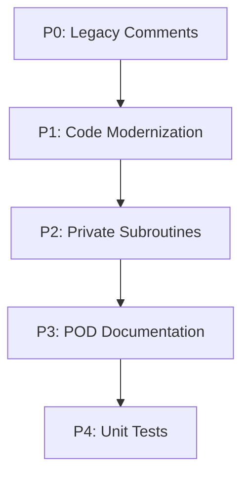

# Implementation Plan: Modernize ConfigServer::Sendmail.pm

**Branch**: `006-modernize-sendmail` | **Date**: 2026-01-28 | **Spec**: [spec.md](spec.md)
**Input**: Feature specification from `/specs/006-modernize-sendmail/spec.md`

## Summary

Modernize `ConfigServer::Sendmail` module to follow cPanel Perl coding standards: remove package-level config loading and side effects (hostname, timezone), remove Exporter machinery, use disabled imports with fully qualified names, rename internal helper `wraptext()` to `_wraptext`, add POD documentation, and create comprehensive unit tests with mocked external dependencies (Net::SMTP, sendmail binary).

## Technical Context

**Language/Version**: Perl 5.36+ (cPanel-provided at `/usr/local/cpanel/3rdparty/bin/perl`)  
**Primary Dependencies**: ConfigServer::Config, ConfigServer::Slurp, Carp, POSIX, Net::SMTP (conditional)  
**Storage**: N/A (sends email via SMTP or sendmail binary)  
**Testing**: Test2::V0 framework with MockConfig for configuration mocking  
**Target Platform**: Linux server with sendmail binary or SMTP access  
**Project Type**: Single Perl module modernization  
**Performance Goals**: N/A (existing behavior preserved)  
**Constraints**: Email delivery is critical; SMTP and sendmail paths must both work  
**Scale/Scope**: Single 190-line module with 2 subroutines (relay, wraptext)

## Constitution Check

*GATE: Must pass before Phase 0 research. Re-check after Phase 1 design.*

| Principle | Status | Notes |
|-----------|--------|-------|
| I. Copyright & Attribution | ✅ PASS | Copyright header (lines 1-18) will be preserved exactly |
| II. Security-First Design | ✅ PASS | Uses three-arg open, validates email addresses |
| III. Perl Standards Compliance | ✅ WILL FIX | Currently violates: Exporter, package-level loadconfig, imports without (), package-level variables |
| IV. Test-First & Isolation | ✅ WILL ADD | Creating t/ConfigServer-Sendmail.t with MockConfig |
| V. Configuration Discipline | ✅ WILL FIX | Config loaded at module level - must move to function |
| VI. Simplicity & Maintainability | ✅ PASS | Module is already simple (2 functions) |

**Gate Result**: PASS - No blocking violations. Modernization will bring module into compliance.

## Project Structure

### Documentation (this feature)

```text
specs/006-modernize-sendmail/
├── spec.md              # Feature specification
├── plan.md              # This file
├── research.md          # Phase 0 output
├── quickstart.md        # Phase 1 output
├── checklists/
│   └── requirements.md  # Validation checklist
└── tasks.md             # Phase 2 output (created by /speckit.tasks)
```

### Source Code (repository root)

```text
lib/
└── ConfigServer/
    └── Sendmail.pm      # Module to modernize

t/
├── lib/
│   └── MockConfig.pm    # Existing test mock utility
└── ConfigServer-Sendmail.t # New test file to create
```

**Structure Decision**: Single module modernization - no new directories needed. Test file follows existing `t/ConfigServer-*.t` naming convention.

## Phase 0: Research

### Dependencies to Research

1. **Net::SMTP mocking** - How to mock SMTP connections for testing
2. **sendmail binary mocking** - How to test sendmail path without spawning processes
3. **Hostname detection** - How to refactor /proc reading from package level
4. **Timezone handling** - How to refactor POSIX::strftime from package level
5. **Conditional require/import** - How to handle Net::SMTP loading at runtime

### Research Tasks

| Topic | Finding |
|-------|---------|
| Net::SMTP mocking | Use Test2::Mock to override `Net::SMTP->new` - return mock object with stubbed methods (mail, to, data, datasend, dataend, quit) |
| sendmail binary mocking | Use Test2::Mock on `CORE::GLOBAL::open` or mock the pipe command; alternatively capture via mock helper |
| Hostname refactoring | Create `_get_hostname()` helper with lazy initialization using state variable |
| Timezone refactoring | Create `_get_timezone()` helper with lazy initialization using state variable |
| Conditional Net::SMTP | Move `require Net::SMTP` inside relay() function, guarded by config check |
| Hostname file reading | Use `ConfigServer::Slurp::slurp()` for simple file reading (avoids manual flock) |
| POSIX strftime | Use `POSIX::strftime()` with `use POSIX ()` |
| Carp carp | Use `Carp::carp()` with `use Carp ()` |

### Open Questions Resolved

All clarification questions answered in spec:
- SMTP failure → carp warning issued, undefined behavior (existing)
- Missing hostname → Default to "unknown" (existing behavior preserved)
- Invalid sendmail path → carp warning, mail not sent (existing behavior preserved)
- Text wrapping edge cases → Preserve existing algorithm exactly

### Package-Level Variables Strategy

**Current State**:
```perl
my $config = ConfigServer::Config->loadconfig();
my %config = $config->config();
my $tz     = strftime( "%z", localtime );
my $hostname;
if ( -e "/proc/sys/kernel/hostname" ) { ... }
```

**Refactoring Strategy**:
1. Remove `$config`/`%config` entirely - use get_config() in relay()
2. Create `_get_timezone()` with state variable for lazy init
3. Create `_get_hostname()` with state variable for lazy init
4. Move Net::SMTP require inside relay() function

## Phase 1: Design

### Data Model

No new entities to design. Function signature and return values preserved:

| Entity | Type | Description |
|--------|------|-------------|
| $to | Input | Recipient email address |
| $from | Input | Sender email address |
| @message | Input | Email message lines (headers + body) |
| (return) | Output | void - email sent or error logged |

### API Contracts

**Public API** (unchanged signature):

```perl
# relay($to, $from, @message) - Send email via SMTP or sendmail
# Should be called as: ConfigServer::Sendmail::relay($to, $from, @message)
sub relay {
    my ( $to, $from, @message ) = @_;
    # ... send email via SMTP or sendmail ...
    return;
}
```

**Private API** (renamed):

```perl
# _wraptext($text, $column) - Wrap text to specified column width
sub _wraptext {
    my $text   = shift;
    my $column = shift;
    # ... wrap text ...
    return $return;
}

# _get_hostname() - Lazily get system hostname
sub _get_hostname {
    state $hostname;
    return $hostname if defined $hostname;
    # ... read from /proc or default to "unknown" ...
    return $hostname;
}

# _get_timezone() - Lazily get timezone offset
sub _get_timezone {
    state $tz;
    return $tz if defined $tz;
    $tz = POSIX::strftime( "%z", localtime );
    return $tz;
}
```

### Implementation Phases

#### Phase 1: P0 - Remove Legacy Comment Clutter

**Files to modify**: `lib/ConfigServer/Sendmail.pm`

**Changes**:
1. Remove `# start main` comment (line 20)
2. Remove `# end main` comment (line 56)
3. Remove `###...###` divider (line 57)
4. Remove `# start sendmail` comment (line 58)
5. Remove `# end sendmail` comment (line 133)
6. Remove `###...###` divider (line 134)
7. Remove `# start wraptext` comment (line 135)
8. Remove `# end wraptext` comment (line 185)
9. Remove `###...###` divider (line 186)

#### Phase 2: P1 - Code Modernization

**Files to modify**: `lib/ConfigServer/Sendmail.pm`

**Import Changes**:
1. Change `use Carp;` to `use Carp ();`
2. Change `use POSIX qw(strftime);` to `use POSIX ();`
3. Add `use ConfigServer::Slurp ()` for hostname file reading
4. Remove `use ConfigServer::CheckIP qw(checkip);` (imported but never used)
5. Remove `use Exporter qw(import);`
6. Remove `our @ISA = qw(Exporter);`
7. Remove `our @EXPORT_OK = qw();`
8. Remove conditional `require Net::SMTP; import Net::SMTP;` at package level

**Package-Level Variable Removal**:
1. Remove `my $config = ConfigServer::Config->loadconfig();`
2. Remove `my %config = $config->config();`
3. Remove `my $tz = strftime( "%z", localtime );`
4. Remove hostname reading block (if/open/flock/close/else)

**New Helper Functions**:
1. Add `_get_hostname()` with lazy initialization via state variable
2. Add `_get_timezone()` with lazy initialization via state variable

**Function Call Updates in relay()**:
1. Replace `carp(...)` with `Carp::carp(...)`
2. Replace `$config{LF_ALERT_SMTP}` with `ConfigServer::Config->get_config('LF_ALERT_SMTP')`
3. Replace `$config{LF_ALERT_TO}` with `ConfigServer::Config->get_config('LF_ALERT_TO')`
4. Replace `$config{LF_ALERT_FROM}` with `ConfigServer::Config->get_config('LF_ALERT_FROM')`
5. Replace `$config{SENDMAIL}` with `ConfigServer::Config->get_config('SENDMAIL')`
6. Replace `$config{DEBUG}` with `ConfigServer::Config->get_config('DEBUG')`
7. Replace `$hostname` with `_get_hostname()`
8. Replace `$tz` with `_get_timezone()`
9. Add `require Net::SMTP;` inside relay() when LF_ALERT_SMTP is set
10. Replace `&wraptext(...)` with `_wraptext(...)`

**Slurp Usage in _get_hostname()**:
1. Use `ConfigServer::Slurp::slurp()` instead of manual open/flock/close

**POSIX Function Updates in _get_timezone()**:
1. Replace `strftime(...)` with `POSIX::strftime(...)`

#### Phase 3: P2 - Make Internal Subroutines Private

**Files to modify**: `lib/ConfigServer/Sendmail.pm`

**Changes**:
1. Rename `sub wraptext` to `sub _wraptext`
2. Update call in relay(): `&wraptext(...)` → `_wraptext(...)`

#### Phase 4: P3 - Add POD Documentation

**Files to modify**: `lib/ConfigServer/Sendmail.pm`

**POD Sections to Add**:
1. NAME section after copyright header
2. SYNOPSIS with usage example
3. DESCRIPTION explaining email delivery functionality
4. FUNCTIONS section documenting relay()
5. CONFIGURATION section listing config values used
6. SEE ALSO section
7. VERSION section (in trailer)
8. AUTHOR section (in trailer)
9. COPYRIGHT AND LICENSE section (in trailer)

#### Phase 5: P4 - Add Unit Test Coverage

**Files to create**: `t/ConfigServer-Sendmail.t`

**Test Cases**:
1. Module loads without package-level side effects
2. Public API exists (relay)
3. Private functions exist (_wraptext, _get_hostname, _get_timezone)
4. _wraptext handles short text (no wrapping needed)
5. _wraptext handles long text (wrapping required)
6. _wraptext handles empty string
7. _wraptext handles text exactly at column width
8. _get_hostname returns string from /proc (mocked)
9. _get_hostname returns "unknown" when /proc missing (mocked)
10. _get_timezone returns timezone string
11. relay() with SMTP path (mock Net::SMTP)
12. relay() with sendmail path (mock open pipe)
13. Email address sanitization works correctly
14. Header parsing and replacement works
15. Time/hostname substitution in message works

## Complexity Tracking

> No constitution violations requiring justification.

## Risk Assessment

| Risk | Mitigation |
|------|------------|
| Email delivery breaks | Preserve exact behavior, comprehensive testing |
| SMTP path untested | Mock Net::SMTP completely |
| sendmail path untested | Mock pipe open |
| Lazy init race conditions | Using Perl `state` which is thread-safe |
| Config value caching | Each call fetches fresh value (acceptable overhead) |

## Dependencies Graph



## Validation Commands

```bash
# Compile check
perl -cw -Ilib lib/ConfigServer/Sendmail.pm

# POD validation
podchecker lib/ConfigServer/Sendmail.pm

# Unit tests
PERL5LIB='' prove -wlvm t/ConfigServer-Sendmail.t

# Regression tests
make test
```
