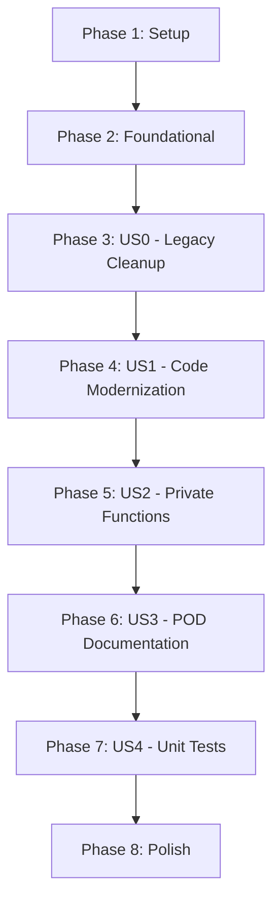

# Tasks: Modernize ConfigServer::Sendmail.pm

**Input**: Design documents from `/specs/006-modernize-sendmail/`  
**Prerequisites**: plan.md (required), spec.md (required), research.md, quickstart.md

**Tests**: Included as User Story 4 (P4) - tests are part of the spec requirements.

**Organization**: Tasks are grouped by user story to enable independent implementation and testing of each story.

## Format: `[ID] [P?] [Story?] Description`

- **[P]**: Can run in parallel (different files, no dependencies)
- **[Story]**: Which user story this task belongs to (US0-US4)
- Include exact file paths in descriptions

---

## Phase 1: Setup

**Purpose**: No setup needed - this is a single module modernization within an existing project.

- [X] T001 Verify module compiles before changes: `perl -cw -Ilib lib/ConfigServer/Sendmail.pm`

---

## Phase 2: Foundational

**Purpose**: No foundational tasks - modernizing existing module with established infrastructure.

**⚠️ CRITICAL**: Module must compile after each user story.

---

## Phase 3: User Story 0 - Remove Legacy Comment Clutter (Priority: P0)

**Goal**: Remove all legacy comment markers (`# start`, `# end`, `###...###` dividers) that clutter the code.

**Independent Test**: `grep -E '# (start|end) ' lib/ConfigServer/Sendmail.pm` returns no results. Module compiles.

### Implementation for User Story 0

- [X] T002 [US0] Remove `# start main` comment marker from lib/ConfigServer/Sendmail.pm
- [X] T003 [US0] Remove `# end main` comment marker from lib/ConfigServer/Sendmail.pm
- [X] T004 [US0] Remove `###...###` divider after main section from lib/ConfigServer/Sendmail.pm
- [X] T005 [US0] Remove `# start sendmail` comment marker from lib/ConfigServer/Sendmail.pm
- [X] T006 [US0] Remove `# end sendmail` comment marker from lib/ConfigServer/Sendmail.pm
- [X] T007 [US0] Remove `###...###` divider after sendmail section from lib/ConfigServer/Sendmail.pm
- [X] T008 [US0] Remove `# start wraptext` comment marker from lib/ConfigServer/Sendmail.pm
- [X] T009 [US0] Remove `# end wraptext` comment marker from lib/ConfigServer/Sendmail.pm
- [X] T010 [US0] Remove `###...###` divider after wraptext section from lib/ConfigServer/Sendmail.pm
- [X] T011 [US0] Verify module compiles after cleanup: `perl -cw -Ilib lib/ConfigServer/Sendmail.pm`

**Checkpoint**: Module free of legacy markers, compiles successfully.

---

## Phase 4: User Story 1 - Code Modernization (Priority: P1) 🎯 MVP

**Goal**: Modernize imports, remove package-level side effects, add helper functions for hostname/timezone.

**Independent Test**: `perl -cw -Ilib lib/ConfigServer/Sendmail.pm` passes. No package-level `loadconfig()` calls. Module loads without side effects.

### Implementation for User Story 1

#### Step 1: Disable Imports

- [X] T012 [US1] Change `use Carp;` to `use Carp ();` in lib/ConfigServer/Sendmail.pm
- [X] T013 [US1] Change `use POSIX qw(strftime);` to `use POSIX ();` in lib/ConfigServer/Sendmail.pm
- [X] T014 [US1] Add `use ConfigServer::Slurp ();` for hostname file reading (replaces Fcntl/flock) in lib/ConfigServer/Sendmail.pm
- [X] T015 [US1] Remove `use ConfigServer::CheckIP qw(checkip);` (unused import) in lib/ConfigServer/Sendmail.pm

#### Step 2: Remove Exporter Machinery

- [X] T016 [US1] Remove `use Exporter qw(import);` statement from lib/ConfigServer/Sendmail.pm
- [X] T017 [US1] Remove `our @ISA = qw(Exporter);` statement from lib/ConfigServer/Sendmail.pm
- [X] T018 [US1] Remove `our @EXPORT_OK = qw();` statement from lib/ConfigServer/Sendmail.pm

#### Step 3: Remove Package-Level Side Effects

- [X] T019 [US1] Remove `my $config = ConfigServer::Config->loadconfig();` from lib/ConfigServer/Sendmail.pm
- [X] T020 [US1] Remove `my %config = $config->config();` from lib/ConfigServer/Sendmail.pm
- [X] T021 [US1] Remove `my $tz = strftime( "%z", localtime );` from lib/ConfigServer/Sendmail.pm
- [X] T022 [US1] Remove hostname initialization block (if/-e/open/flock/close/else) from lib/ConfigServer/Sendmail.pm
- [X] T023 [US1] Remove conditional `eval { require Net::SMTP; import Net::SMTP; };` block from lib/ConfigServer/Sendmail.pm

#### Step 4: Add Helper Functions

- [X] T024 [US1] Add `_get_hostname()` function with lazy initialization using state variable in lib/ConfigServer/Sendmail.pm
- [X] T025 [US1] Add `_get_timezone()` function with lazy initialization using state variable in lib/ConfigServer/Sendmail.pm

#### Step 5: Update Function Calls in relay()

- [X] T026 [US1] Replace `carp(...)` with `Carp::carp(...)` in relay() function in lib/ConfigServer/Sendmail.pm
- [X] T027 [US1] Replace `$config{LF_ALERT_SMTP}` with `ConfigServer::Config->get_config('LF_ALERT_SMTP')` in relay() in lib/ConfigServer/Sendmail.pm
- [X] T028 [US1] Replace `$config{LF_ALERT_TO}` with `ConfigServer::Config->get_config('LF_ALERT_TO')` in relay() in lib/ConfigServer/Sendmail.pm
- [X] T029 [US1] Replace `$config{LF_ALERT_FROM}` with `ConfigServer::Config->get_config('LF_ALERT_FROM')` in relay() in lib/ConfigServer/Sendmail.pm
- [X] T030 [US1] Replace `$config{SENDMAIL}` with `ConfigServer::Config->get_config('SENDMAIL')` in relay() in lib/ConfigServer/Sendmail.pm
- [X] T031 [US1] Replace `$config{DEBUG}` with `ConfigServer::Config->get_config('DEBUG')` in relay() in lib/ConfigServer/Sendmail.pm
- [X] T032 [US1] Replace `$hostname` variable with `_get_hostname()` call in relay() in lib/ConfigServer/Sendmail.pm
- [X] T033 [US1] Replace `$tz` variable with `_get_timezone()` call in relay() in lib/ConfigServer/Sendmail.pm
- [X] T034 [US1] Add `use Net::SMTP ();` at module level with disabled import in lib/ConfigServer/Sendmail.pm
- [X] T036 [US1] Verify module compiles after modernization: `perl -cw -Ilib lib/ConfigServer/Sendmail.pm`

**Checkpoint**: Module modernized, no package-level side effects, all tests pass.

---

## Phase 5: User Story 2 - Make Internal Subroutines Private (Priority: P2)

**Goal**: Rename internal helper function `wraptext()` to `_wraptext()` to indicate private API.

**Independent Test**: `grep 'sub _wraptext' lib/ConfigServer/Sendmail.pm` finds the function. `grep 'sub wraptext' lib/ConfigServer/Sendmail.pm` finds nothing.

### Implementation for User Story 2

- [X] T037 [US2] Rename `sub wraptext` to `sub _wraptext` in lib/ConfigServer/Sendmail.pm
- [X] T038 [US2] Update call from `&wraptext(...)` to `_wraptext(...)` in relay() function in lib/ConfigServer/Sendmail.pm
- [X] T039 [US2] Verify module compiles after rename: `perl -cw -Ilib lib/ConfigServer/Sendmail.pm`

**Checkpoint**: Internal function properly marked as private.

---

## Phase 6: User Story 3 - Add POD Documentation (Priority: P3)

**Goal**: Add comprehensive POD documentation for the module.

**Independent Test**: `podchecker lib/ConfigServer/Sendmail.pm` reports "pod syntax OK".

### Implementation for User Story 3

- [X] T040 [US3] Add POD NAME section after copyright header in lib/ConfigServer/Sendmail.pm
- [X] T041 [US3] Add POD SYNOPSIS section with usage example in lib/ConfigServer/Sendmail.pm
- [X] T042 [US3] Add POD DESCRIPTION section explaining email delivery in lib/ConfigServer/Sendmail.pm
- [X] T043 [US3] Add POD FUNCTIONS section documenting relay() in lib/ConfigServer/Sendmail.pm
- [X] T044 [US3] Add POD CONFIGURATION section listing config values used in lib/ConfigServer/Sendmail.pm
- [X] T045 [US3] Add POD SEE ALSO section in lib/ConfigServer/Sendmail.pm
- [X] T046 [US3] Add POD trailer (VERSION, AUTHOR, COPYRIGHT AND LICENSE) after `1;` in lib/ConfigServer/Sendmail.pm
- [X] T047 [US3] Verify POD syntax: `podchecker lib/ConfigServer/Sendmail.pm`

**Checkpoint**: Full POD documentation added and validated.

---

## Phase 7: User Story 4 - Add Unit Test Coverage (Priority: P4)

**Goal**: Create comprehensive unit tests with mocked external dependencies.

**Independent Test**: `PERL5LIB='' prove -wlvm t/ConfigServer-Sendmail.t` passes.

### Implementation for User Story 4

#### Test File Setup

- [X] T048 [US4] Create test file t/ConfigServer-Sendmail.t with standard Test2::V0 boilerplate
- [X] T049 [US4] Add module load test verifying no package-level side effects in t/ConfigServer-Sendmail.t

#### API Existence Tests

- [X] T050 [P] [US4] Add test for public API existence (relay function) in t/ConfigServer-Sendmail.t
- [X] T051 [P] [US4] Add test for private function existence (_wraptext, _get_hostname, _get_timezone) in t/ConfigServer-Sendmail.t

#### _wraptext Unit Tests

- [X] T052 [P] [US4] Add _wraptext tests: short text (no wrapping needed) in t/ConfigServer-Sendmail.t
- [X] T053 [P] [US4] Add _wraptext tests: long text requiring wrapping in t/ConfigServer-Sendmail.t
- [X] T054 [P] [US4] Add _wraptext tests: empty string handling in t/ConfigServer-Sendmail.t
- [X] T055 [P] [US4] Add _wraptext tests: text exactly at column width in t/ConfigServer-Sendmail.t
- [X] T056 [P] [US4] Add _wraptext tests: text with no spaces (edge case) in t/ConfigServer-Sendmail.t

#### _get_hostname Unit Tests

- [X] T057 [P] [US4] Add _get_hostname test: returns string from /proc (mocked) in t/ConfigServer-Sendmail.t
- [X] T058 [P] [US4] Add _get_hostname test: returns "unknown" when /proc missing (mocked) in t/ConfigServer-Sendmail.t

#### _get_timezone Unit Tests

- [X] T059 [P] [US4] Add _get_timezone test: returns timezone offset string in t/ConfigServer-Sendmail.t

#### relay() SMTP Path Tests

- [X] T060 [US4] Add relay test: SMTP path with mocked Net::SMTP in t/ConfigServer-Sendmail.t
- [X] T061 [US4] Add relay test: SMTP connection verifies correct method calls in t/ConfigServer-Sendmail.t
- [X] T062 [US4] Add relay test: SMTP failure issues carp warning in t/ConfigServer-Sendmail.t

#### relay() sendmail Path Tests

- [X] T063 [US4] Add relay test: sendmail path with mocked pipe in t/ConfigServer-Sendmail.t
- [X] T064 [US4] Add relay test: sendmail failure issues carp warning in t/ConfigServer-Sendmail.t

#### Email Processing Tests

- [X] T065 [P] [US4] Add relay test: email address sanitization in t/ConfigServer-Sendmail.t
- [X] T066 [P] [US4] Add relay test: header parsing and replacement in t/ConfigServer-Sendmail.t
- [X] T067 [P] [US4] Add relay test: hostname/timezone substitution in message in t/ConfigServer-Sendmail.t

#### Final Validation

- [X] T068 [US4] Run full test suite: `PERL5LIB='' prove -wlvm t/ConfigServer-Sendmail.t`
- [X] T069 [US4] Run regression tests: `make test`

**Checkpoint**: All unit tests pass, comprehensive coverage achieved.

---

## Phase 8: Polish & Validation

**Purpose**: Final validation and cleanup

- [X] T070 Verify all success criteria from spec.md
- [X] T071 Run full test suite: `make test`
- [X] T072 Verify no package-level loadconfig: `grep -n 'loadconfig' lib/ConfigServer/Sendmail.pm | grep -v 'sub\|#'`
- [X] T073 Verify no legacy markers: `grep -E '# (start|end) ' lib/ConfigServer/Sendmail.pm`
- [X] T074 Verify no Exporter: `grep -E '@EXPORT|@ISA|use Exporter' lib/ConfigServer/Sendmail.pm`
- [X] T075 Commit changes with proper commit message

---

## Dependencies & Execution Order

### Phase Dependencies



### User Story Dependencies

- **US0 (P0)**: No dependencies - can start after setup verification
- **US1 (P1)**: Depends on US0 completion - core modernization
- **US2 (P2)**: Depends on US1 - renames function that US1 refactored
- **US3 (P3)**: Depends on US2 - documents final API
- **US4 (P4)**: Depends on US3 - tests final implementation

### Within Each User Story

- Tasks within import changes (T012-T015) can run in parallel [P]
- Tasks within Exporter removal (T016-T018) can run in parallel [P]
- Tasks within config replacement (T027-T031) can run in parallel [P]
- Test tasks within US4 marked [P] can run in parallel

### Parallel Opportunities

```bash
# Phase 4 (US1) - Parallel import changes:
T012: Change use Carp to disabled import
T013: Change use POSIX to disabled import
T014: Add ConfigServer::Slurp for hostname reading (replaces Fcntl)
T015: Remove use ConfigServer::CheckIP (unused import)

# Phase 7 (US4) - Parallel test tasks:
T050: Test public API existence
T051: Test private function existence
T052-T056: _wraptext tests
T057-T059: Helper function tests
T065-T067: Email processing tests
```

---

## Implementation Strategy

### MVP First (User Story 1 Only)

1. Complete Phase 1: Setup (T001)
2. Complete Phase 3: US0 - Legacy Cleanup (T002-T011)
3. Complete Phase 4: US1 - Code Modernization (T012-T036)
4. **STOP and VALIDATE**: Module compiles, no side effects
5. Can deploy modernized module without tests

### Incremental Delivery

1. US0 → Module clean of legacy markers
2. US1 → Module modernized (MVP!)
3. US2 → API clearly distinguished
4. US3 → Fully documented
5. US4 → Fully tested

---

## Summary

| Phase | Story | Task Range | Count | Description |
|-------|-------|------------|-------|-------------|
| 1 | Setup | T001 | 1 | Verify initial compilation |
| 3 | US0 | T002-T011 | 10 | Remove legacy comment markers |
| 4 | US1 | T012-T036 | 25 | Code modernization (MVP) |
| 5 | US2 | T037-T039 | 3 | Rename internal functions |
| 6 | US3 | T040-T047 | 8 | Add POD documentation |
| 7 | US4 | T048-T069 | 22 | Add unit tests |
| 8 | Polish | T070-T075 | 6 | Final validation |
| **Total** | | | **75** | |

---

## Notes

- [P] tasks = different files or independent within same file
- [Story] label maps task to specific user story
- Each user story builds on previous but adds independent value
- Module must compile after each phase
- Commit after each logical group of tasks
